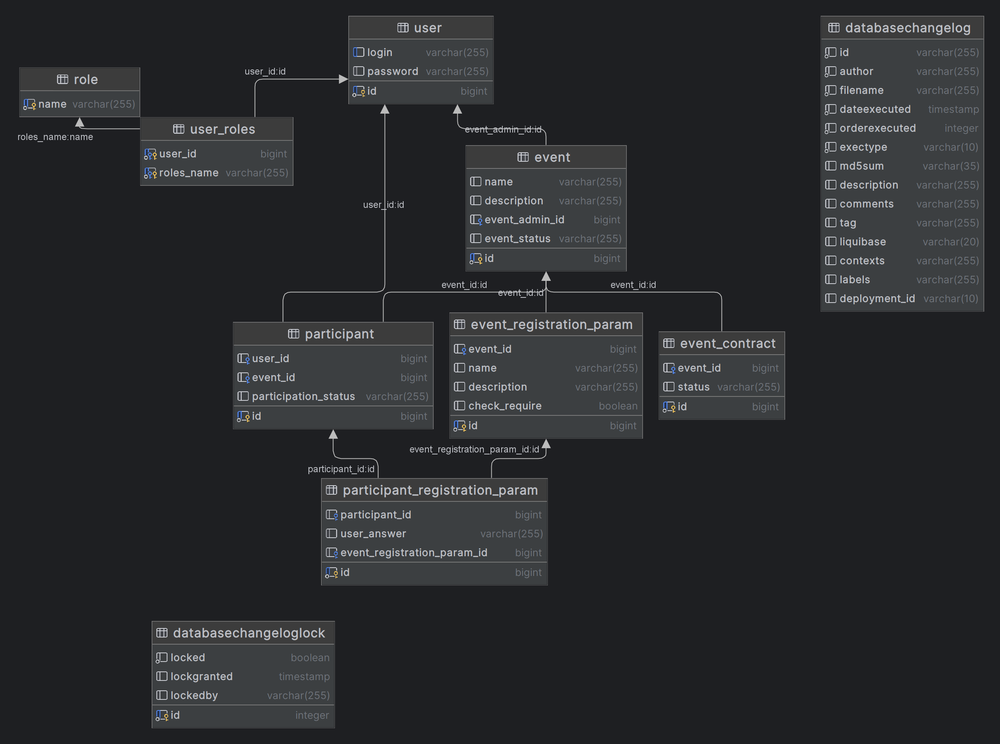

## EventConnect

## application start requires docker!!!
## Run
```shell
docker-compose up

./gradlew bootRun
```
Swagger run on\
http://localhost:8080/api/swagger-ui/index.html

## Tests
### Attention tests uses testcontainers 
```shell
./grdlew test 
```
jacoco test report

current coverage 60%
## DB


